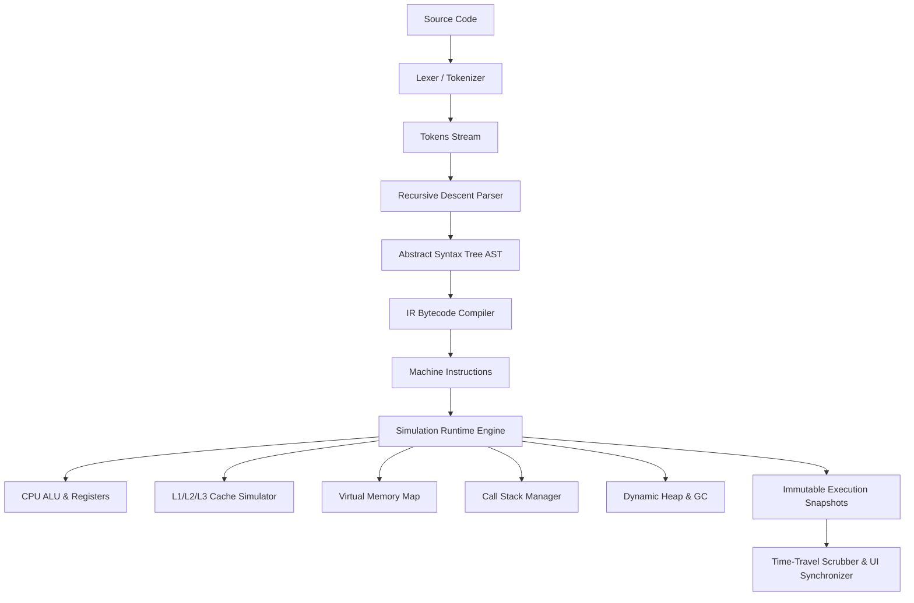

https://mrityunjaydwived.github.io/code-to-computer/
# 🧠 CODE → COMPUTER
> **Write Code. See What The Computer Actually Does.**

An interactive, educational, visually impressive Computer Science visualization platform that exposes the complete journey between writing high-level code and physical computer execution.

---

```
SOURCE CODE (Python)
        ↓
LEXICAL ANALYSIS (Tokens)
        ↓
SYNTAX ANALYSIS (AST)
        ↓
INTERMEDIATE REPRESENTATION (IR Bytecode)
        ↓
CPU EXECUTION (ALU & 5-Stage Cycle)
        ↓
REGISTERS (RAX, RBX, RCX, RDX, RSP, RBP, RIP, Flags)
        ↓
CACHE HIERARCHY (L1, L2, L3 & EMAT)
        ↓
VIRTUAL MEMORY (RAM, Stack Frames & Dynamic Heap)
        ↓
GARBAGE COLLECTION (Mark & Sweep)
        ↓
PROGRAM OUTPUT (STDOUT)
```

---

## 🌟 Key Features

### 1. Deterministic Sandboxed Simulation Engine
- **Safe & Sandboxed**: 100% in-browser deterministic Python compiler and virtual machine runtime without `eval()`.
- **Lexical Analysis**: Live interactive token stream with category highlights (`keyword`, `identifier`, `literal`, `operator`, `separator`).
- **AST Generation**: Recursive descent parser producing an interactive hierarchical tree with clickable nodes and semantic explanations.
- **IR Bytecode Compiler**: Lowers high-level code into low-level virtual assembly instructions (`MOV`, `ADD`, `CMP`, `JZ`, `CALL`, `RET`, `ALLOC_HEAP`).

### 2. Micro-Architecture & CPU Visualizer
- **Register Bank**: RAX (Accumulator), RBX (Base), RCX (Counter), RDX (Data), RSP (Stack Pointer), RBP (Base Pointer), RIP (Instruction Pointer), and Condition Flags (ZF, SF, OF). Features glowing transition deltas (`10 → 30`) with Decimal, Hexadecimal, and 16-bit Binary modes.
- **ALU (Arithmetic Logic Unit)**: Real-time operator display, inputs, and calculated outputs with flag triggers.
- **5-Stage Instruction Cycle**: Active visual tracking across `FETCH` → `DECODE` → `EXECUTE` → `MEMORY` → `WRITE_BACK`.
- **Animated System Bus**: Visual interconnect highway with traveling pulses connecting CPU, Cache, and Memory.

### 3. Multi-Level Cache Hierarchy
- **L1 / L2 / L3 Caches**: Simulated SRAM cache lines with valid bits, tags, and data.
- **Cache Hit / Miss Ratio**: Real-time ratio tracking and cumulative latency penalties.
- **Effective Memory Access Time (EMAT)**: Dynamic formula calculation comparing cached speed vs 100-cycle un-cached DRAM accesses.

### 4. Virtual Memory, Stack & Heap
- **RAM Memory Map**: Contiguous 32-bit aligned address table starting at `0x00001000`.
- **Memory Address Inspector**: Click any variable to inspect 32-bit binary nibbles, hex representation, Little-Endian physical byte ordering, and type width.
- **Call Stack Visualizer**: Stack frames for `main()` and nested functions with arguments, local variables, and RBP/RSP frame boundaries.
- **Dynamic Heap Memory**: Contiguous block allocation, object fields, and pointer links from stack references.
- **Garbage Collector**: Mark-and-sweep reachability simulation from stack roots with manual "Trigger GC Sweep" reclamation.

### 5. Interactive 3D Silicon Mode
- **WebGL 3D Architecture**: Powered by Three.js with full OrbitControls (mouse rotation, zoom, pan).
- **Physical Layout**: Detailed 3D motherboard PCB, glowing CPU die, L1/L2 cache banks, dual-channel RAM DIMM sticks, and animated data packet particles traversing buses.

### 6. Time-Travel Debugging
- **Zero-Lag Scrubber**: Step forward, step backward, jump to any step, or replay execution. Every computational transition produces an immutable `ExecutionSnapshot`.

### 7. Educational Modes & "Why?" Explanations
- **"Why?" Contextual Drawer**: Available for every execution step.
- **Three Educational Perspectives**:
  - 👶 **Beginner Mode**: Everyday metaphors and plain English explanations.
  - 💻 **Technical CS Mode**: Rigorous Computer Science and Operating Systems concepts.
  - 🎓 **GATE Exam Mode**: Addressing modes, Register Transfer Language (RTL) notation, and pipeline hazard analysis.
- **Interactive CS Lessons & Quizzes**: Guided mini-lessons with multiple-choice questions and instant feedback.
- **GATE Numerical Problem Solver**: Interactive EMAT, Pipelining Speedup, and Direct-Mapped Cache Tag/Index calculators.
- **Real-World Systems Walkthrough**: Deconstructions of what happens when an app like Instagram opens or when a 3D game engine launches.

---

## 🛠 Technology Stack

- **Frontend**: React 19, TypeScript, Vite
- **Styling**: Tailwind CSS v4 (Dark Developer Design System)
- **3D Graphics**: Three.js WebGL with custom orbital camera
- **State Management**: Zustand with immutable execution snapshots
- **Icons**: Lucide React
- **Celebration Effects**: Canvas Confetti
- **Testing**: Vitest unit test suite

---

## 🚀 Quickstart

### Prerequisites
- Node.js (v18+)
- npm or pnpm

### Installation

```bash
# Clone or navigate to the directory
cd "Data Structure Visualizer"

# Install dependencies
npm install

# Start development server
npm run dev
```

### Running Unit Tests

```bash
# Run Vitest suite
npx vitest run
```

### Building for Production

```bash
npm run build
```

---

## ⌨️ Keyboard Shortcuts

| Shortcut | Action |
|---|---|
| `Space` | Run / Pause Execution |
| `→` (Right Arrow) | Step Forward |
| `←` (Left Arrow) | Step Backward |
| `R` | Reset Simulation |
| `Ctrl + K` / `Cmd + K` | Open Command Palette |

---

## 📜 Architecture Diagram



---

## 🚀 CI/CD Pipeline & GitHub Deployment

The repository includes an automated GitHub Actions CI/CD pipeline (`.github/workflows/deploy.yml`) that automatically tests, builds, and deploys the application to **GitHub Pages** on every push to the `main` branch.

### How to Deploy to Your GitHub:

1. **Create a new repository** on [GitHub](https://github.com/new) (e.g. named `code-to-computer`).
2. **Link your repository and push**:
   ```bash
   git remote add origin https://github.com/<YOUR_USERNAME>/<YOUR_REPOSITORY>.git
   git push -u origin main
   ```
3. **Enable GitHub Pages**:
   - In your GitHub repository, go to **Settings** → **Pages**.
   - Under **Build and deployment** → **Source**, select **GitHub Actions**.
4. **Automated Deployment**:
   - The CI/CD pipeline will automatically run all unit tests, compile the bundle, and deploy to:
     `https://<YOUR_USERNAME>.github.io/<YOUR_REPOSITORY>/`

---

## 📄 License
MIT License. Built for educational computer science visualization.

